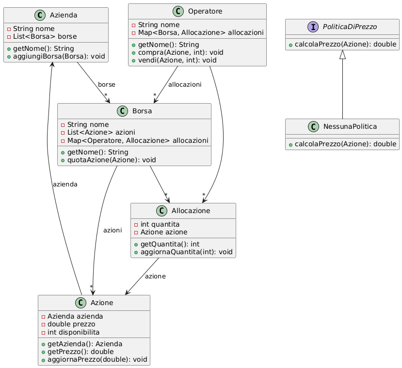
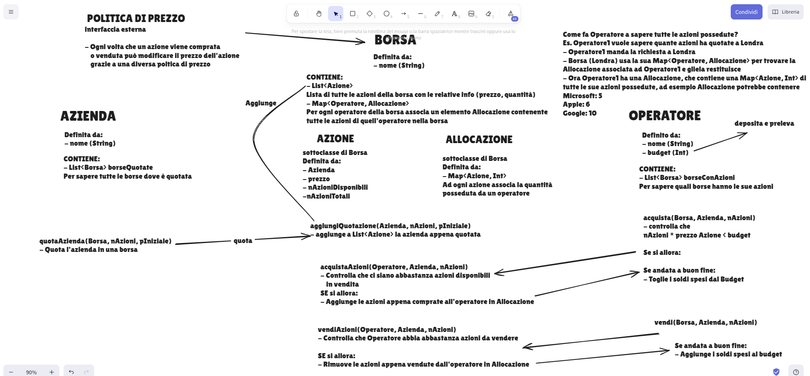

# Bo{r,s}a 👜

La seguente repository contiene il progetto sviluppato nell'ambito del corso di Programmazione II del professore Massimo Santini nell'anno accademico 24/25

Il progetto realizzato in Java gestisce una borsa e le sue operazioni

Nel file [ISTRUZIONI.html](ISTRUZIONI.html) sono presenti le regole del progetto e in [README.html](README.html) sono presenti le specifiche del progetto

Le entità presenti nel progetto sono le seguenti:

### Azienda

Rappresenta una Azienda che può quotarsi nella borsa

### Operatore

Un operatore che può acquistare e vendere azioni di Aziende tramite la Borsa

### Borsa

Gestisce le operazioni di allocazione, vendita e acquisto, cambio valore e politica di prezzo delle azioni

## Organizzazione

Il progetto è gestito nel seguente modo:

- All'interno della cartella `src/main` sono presenti due cartelle:
    - `borsanova` contiene i file java del progetto in se
    - `clients` contiene i client implementati per testare le funzionalità del progetto
- Nella cartella `tests/clients` sono contenuti i test che utilizzano i clients per testare il progetto, dove:
    - `args` sono argomenti di riga di comando
    - `input` sono valori passati in input
    - `expected` sono gli output richiesti con l'input forniti

## Funzionalità

Il progetto passa tutti i test ed è perfettamente funzionante e permette di:

* Quotare una Azienda nella Borsa
* Operatore può comprare/vendere le proprie azioni
* Operatore puù aumentare/diminuire il suo budget
* Borsa gestisce le operazioni di vendita
* Borsa può cambiare la politica di prezzo applicata dopo le vendite

*Francesco Corrado 2025*